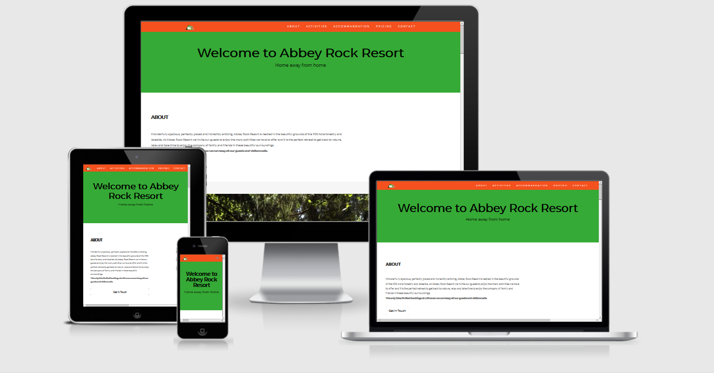

# Abbey Rock Retreat
[GitHub Pages Live Site](https://jay-o-sullivan.github.io/ms2Project/)

This website is a dynamic front-end based on a made up retreat for camping whether it be in a tent, caravan or a camper.
Its a staycation in ireland while covid19 is here and that is where i got my idea from as no holidays abroad while in lockdown.

[view the live site here](https://jay-o-sullivan.github.io/ms2Project/)

# Index
 1. [UX](#ux)
 1. [Features](#features)
 1. [Technologies Used](#technologies-used)
 1. [Testing](#testing)
 1. [Deployment](#deployment)
 1. [Credits](#credits)

## UX
 
Use this section to provide insight into your UX process, focusing on who this website is for, what it is that they want to achieve and how your project is the best way to help them achieve these things.

In particular, as part of this section we recommend that you provide a list of User Stories, with the following general structure:
- As a user type, I want to perform an action, so that I can achieve a goal.

This section is also where you would share links to any wireframes, mockups, diagrams etc. that you created as part of the design process. These files should themselves either be included as a pdf file in the project itself (in an separate directory), or just hosted elsewhere online and can be in any format that is viewable inside the browser.

## Wireframes
- The wireframes below is of the website on a android phone, desktop and ipad.
- [wireframes](assets/images/ms2_wireframes.pdf)

## Features

Each page features consistent design via use of colours to facilitate an intuitive and comfortable user experience. 
This website has a number of pages which include these About, Activities, Accommodation, Pricing and Contact. which are all linked to the tab bar.

1. About page with the name of the retreat and also a bit of information and also a link button to direct to the contact page and it also has a carousel of photos.
2. Activities page with pictures showing what activities the retreat has to offer.
3. Accommodation page with pictures showing what is allowed in the retreat.
4. A comment section of what quests and visitors have said about the retreat.
5. Pricing page which has 3 different panels with a button that links to 404 error page.
6. Contact page which has the basic contact information and also the contact form.
7. A basic map of the area.
8. The footer has a '^' to return to top and a google translate drop-down to select a language.
 

### Features Left to Implement
- Add a payment page that users can pay and book online.
- Blog type page where users can interact and leave recommendations of the retreat.
- Newsletter that sends users the latest news and offers.

## Technologies Used

- [JQuery](https://jquery.com)
- [Bootstrap](https://getbootstrap.com)
- [JavaScript](https://javascript.com)
- [HTML5](https://html.com)
- [CSS3](https://www.w3.org/TR/2001/WD-css3-roadmap-20010523/)

## Testing

In this section, you need to convince the assessor that you have conducted enough testing to legitimately believe that the site works well. Essentially, in this part you will want to go over all of your user stories from the UX section and ensure that they all work as intended, with the project providing an easy and straightforward way for the users to achieve their goals.

Whenever it is feasible, prefer to automate your tests, and if you've done so, provide a brief explanation of your approach, link to the test file(s) and explain how to run them.

For any scenarios that have not been automated, test the user stories manually and provide as much detail as is relevant. A particularly useful form for describing your testing process is via scenarios, such as:

1. Contact form:
    1. Go to the "Contact Us" page
    2. Try to submit the empty form and verify that an error message about the required fields appears
    3. Try to submit the form with an invalid email address and verify that a relevant error message appears
    4. Try to submit the form with all inputs valid and verify that a success message appears.

In addition, you should mention in this section how your project looks and works on different browsers and screen sizes.

You should also mention in this section any interesting bugs or problems you discovered during your testing, even if you haven't addressed them yet.

If this section grows too long, you may want to split it off into a separate file and link to it from here.

## Deployment

This section should describe the process you went through to deploy the project to a hosting platform (e.g. GitHub Pages or Heroku).

In particular, you should provide all details of the differences between the deployed version and the development version, if any, including:
- Different values for environment variables (Heroku Config Vars)?
- Different configuration files?
- Separate git branch?

In addition, if it is not obvious, you should also describe how to run your code locally.

## Credits

#### Content
* Structure and content based heavily on:
  * [Code Institute Solutions - README Template](https://github.com/Code-Institute-Solutions/readme-template)
  * {W3 Schools](https://www.w3schools.com/) - Various resources throughout the project 
 
### Media
- The photos used in this site were obtained from 
 - [pexels](https://www.pexels.com/)
 - [pixabay](https://pixabay.com/)
 - [am i responsive](http://ami.responsivedesign.is/)

### Acknowledgements

* [W3 Schools](https://www.w3schools.com/) - Various resources
* [Free logo maker](https://logomakr.com/9Z9zAo) - logo maker
* [TingPNG](https://tinypng.com/) - image resizing
