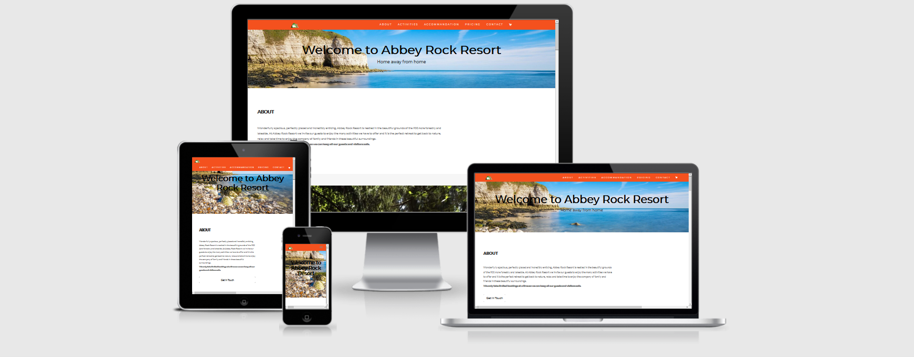

# Abbey Rock Retreat
[GitHub Pages Live Site](https://jay-o-sullivan.github.io/ms2Project/)

This website is a dynamic front-end based on a made up retreat for camping whether it be in a tent, caravan or a camper.
Its a staycation in ireland while covid19 is here and that is where i got my idea from as no holidays abroad while in lockdown.

[view the live site here](https://jay-o-sullivan.github.io/ms2Project/)

# Index
 1. [UX](#ux)
 1. [Features](#features)
 1. [Technologies Used](#technologies-used)
 1. [Testing](#testing)
 1. [Deployment](#deployment)
 1. [Credits](#credits)

## UX
 
This website is for people who are looking for a getaway retreat that caravans, campervans and even camping is space for all and it brings people back to basics and some relaxation from the busy world we live in.
This project is for people trying to get a break away while also have some fun and staying safe while covid19 is here, it has all the activities and prices on the website, a contact form.

### User Stories
- As a first time user, I want to find out what they have to offer, so that I can decide if it is the place for me and/or my family.
- As a first time user, I want to be able to easily navigate to the activities, so that it is easy for me to get all the information on these.
- As a first time user, I want to be able to get in contact with the owners, so that i can see if they have everthing on my booking.
- As a returning user, I want to easily access everything in the site, 
- As a regular user, I want to get straight to my booking, so i can have another vaccation away.

## Wireframes
- The wireframes below is of the website on a android phone, desktop and ipad.
- [wireframes](assets/ms2_wireframes.pdf)

## Features

Each page features consistent design via use of colours to facilitate an intuitive and comfortable user experience. 
This website has a number of pages which include these About, Activities, Accommodation, Pricing and Contact. which are all linked to the tab bar.

1. About page with the name of the retreat and also a bit of information and also a link button to direct to the contact page and it also has a carousel of photos.
2. Activities page with pictures showing what activities the retreat has to offer.
3. Accommodation page with pictures showing what is allowed in the retreat.
4. A comment section of what quests and visitors have said about the retreat.
5. Pricing page which has 3 different panels with a button that links to 404 error page.
6. Contact page which has the basic contact information and also the contact form.
7. A basic map of the area.
8. The footer has a '^' to return to top and a google translate drop-down to select a language.
 

### Features Left to Implement
- Add a payment page that users can pay and book online.
- Blog type page where users can interact and leave recommendations of the retreat.
- Newsletter that sends users the latest news and offers.

## Technologies Used

- [JQuery](https://jquery.com)
- [Bootstrap](https://getbootstrap.com)
- [JavaScript](https://javascript.com)
- [HTML5](https://html.com)
- [CSS3](https://www.w3.org/TR/2001/WD-css3-roadmap-20010523/)
 

## Testing

### User Stories Testing
- As a first time user, I want to find out what they have to offer, so that I can decide if it is the place for me and/or my family.
  - The about page provides a brief description of the place and what they have to offer.
- As a first time user, I want to be able to easily navigate to the activities, so that it is easy for me to get all the information on these.
  - The Activities page provides a brief description of what activities they have there.
- As a first time user, I want to be able to get in contact with the owners, so that i can see if they have everthing on my booking.
  - The contact page has all the information if needed to be contacted.
- As a regular user, I want to get straight to pricing and booking, so i can have another vaccation away.
  - Users can bookmark feature in the browser, or navigate through the site

## Manual Testing

### Home
- Check to see if tab title is displaying correctly.
- Checked all links to make sure they open the correct content.
- Tested across various devices ( android phone, ipad, desktop, laptop) testing responsiveness

### About
- Checked title is displaying correctly in tab
- Checked the (get in touch button) is sending to the right tab.
- Checked the photo carousel is working correctly.

### Activities
- Checked title is displaying correctly in tab
- Checked all images are working
- Checked all the text content is displaying correctly

### Accommondation
- Checked title is displaying correctly in tab
- Checked images are displaying correctly
- Checked all text content is correct
- Checked the comment carousel is working correctly.

## Validators Used

- [JSHint](https://jshint.com/) - for validating JavaScript

(assets/images/jshint-js-validator.PNG) 
- [W3C](https://validator.w3.org/) - for validating HTML
(assets/images/w3-html-validator.PNG)
- [W3C](https://jigsaw.w3.org/css-validator/) - for validating CSS
(assets/images/w3-css-validator.PNG)

## Deployment

The website was created using [GitPod](https://github.com). Version control was undertaken by committing to Git and pushing to GitHub using the functions within GitPod.

### GitPod
 - In GitPod, ensure that all required items have been committed and pushed to GitHub.
 - Sign in to GitHub.
 - Choose the appropriate repository - jay-o-sullivan/ms2Project
 - From the menu choose the settings tab.
  (assets/images/settings.PNG)
 - Then scroll down to github pages.
  (assets/images/pages.PNG) 
 - Click the URl to view the deployed website.

## Run code locally
 - There is different approaches should you choose to use GitPod to clone the project, or a different IDE.
    - Use web browser -- google -- firefox etc.
    - Login to your github account or sign up if you haven't.
    - Install the gitpod extenstion for your browser.
    - In github find the repository.
    - Click on gitpod button. 
    (assets/images/gitpod-button.PNG)
    - New workspace will open containing the project code.

## Cloning 
 - Navigate to the github repository.
 - Choose the dropdown on the code button.
 (assets/images/clone.PNG)
 - Open your IDE and terminal.
 - Set the working directory to location.
 - Type in "git clone" followed by the URL. Make sure to include a space after git clone for the url, press enter.
 - Project created.

 For more information on [GitHub] visit (https://docs.github.com/en)
 

## Credits

#### Content
* Structure and content based heavily on:
  * [Code Institute Solutions - README Template](https://github.com/Code-Institute-Solutions/readme-template)
  * {W3 Schools](https://www.w3schools.com/) - Various resources throughout the project.
  * [JSFiddle](https://jsfiddle.net/macloo/g39k3h3e/) - for bounce and shake effects.
 
### Media

- The photos used in this site were obtained from 
 - [pexels](https://www.pexels.com/)
 - [pixabay](https://pixabay.com/)
 - [am i responsive](http://ami.responsivedesign.is/)

### Acknowledgements

* [W3 Schools](https://www.w3schools.com/) - Various resources
* [Free logo maker](https://logomakr.com/9Z9zAo) - logo maker
* [TingPNG](https://tinypng.com/) - image resizing
* [CodeRepublics](https://www.coderepublics.com/howto/how-to-google-translate.php) - google translate
* [Google Maps Platform](https://developers.google.com/maps/documentation) - map
* [GitHub](https://github.com/March-Hackathon-Team-27/Hackathon-Project-canRename-) - README template
